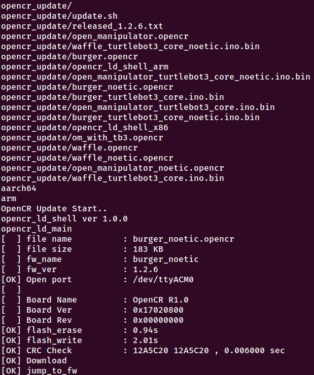

# Turtlebot burger PC install and turtlebot setup

These scripts install all dependencies and makes network setup easy for both pc and turtlebot3 burger. These scripts currently only support Ros1 installations (Melodic and Noetic). A prior installation of ros is not required as the script will automatically install ros if not already installed.

## UBUNTU PC SETUP

1. Open terminal. Clone repository to Ubuntu(mint) pc:
```
  sudo apt install git -y
  git clone https://github.com/dabwitso/turtlebot3_setup.git
  cd turtlebot3_setup/ubuntu_pc/
```
2. Run installation script which installs all turtlebot3 dependencies. It will also install Ros for ubuntu distro (i.e, 18.04 or 20.04) if not already installed.
```
  ./turtlebot3_pc_install.sh
```

3. Configure pc network parameters for Ros. In terminal run:
```
  ./turtlebot3_pc_network_config.sh
```

4. Connect (Raspberry Pi) sd card to pc and install Turtlebot3 Raspberry Pi OS. Launch **Disks** software by pressing windows key and searching for Disks.

The image is located in **turtlebot3_setup/os_image** folder included in git cloned directory.

Close **Disks** when image burning is completed.

4. In terminal, launch gparted to resize sd card.
```
  sudo apt install gparted -y
  sudo gparted &
```


5. Eject sd card from pc and insert it again.

6. In same terminal, **turtlebot3_setup/ubuntu_pc**, configure wifi setting for sd card which will ensure network connectivity upon inserting sd card into turtlebot3.
```
  ./turtlebot3_sdcard_config.sh -n wifi -s [WIFI_SSID] -p [WIFI_PASSWORD]
```
**NOTE:** Replace [] with details for your wifi access point.

7. source your shell in terminal. Only run one command that matches the shell you are using, either bash or zsh in our case.
```
  source ~/.zshrc
  source ~/.bashrc
```
8. Eject sd card and insert it into turtlebot3 Raspberry Pi sd card slot.

**NOTE** Always run the following script whenever you reboot your PC or connect to a new network. Make sure to change directory into the git cloned turtlebot3_setup/ubuntu_pc directory before running this command:
```
  ./turtlebot3_pc_network_config.sh
```

## TURTLEBOT3 SETUP
Connect turtlebot3 to monitor via hdmi cable, and connect a keyboard. Power on and login using:
```
  login: ubuntu
  password: turtlebot
```

1. Clone github repository.
```
  mkdir turtlebot3 && cd turtlebot3
  git init
  git remote add origin https://github.com/dabwitso/turtlebot3_setup.git
  git fetch origin
  git checkout origin/main -- turtlebot
  cd turtlebot

```
2. Run inital installation script:
```
  ./turtlebot3_robot_install.sh
```

3. It has been noted that a process at times fails to release dpkg and causes error when trying to run subsequent commands which require to install packages using dpkg. To ensure this is not the case, run:
```
  sudo apt-get install libc6:armhf
```

If you get an error **dpkg lock**, press **CTRL + C** and kill the process using its PID number e.g 2342 run:
```
  sudo kill -9 2342
```
Replace 2342 with the number you see in terminal.

Retry to install package again:
```
  sudo apt-get install libc6:armhf
```
If you don't get any error, then you can proceed to next step. If you get same error, kill the process you see in terminal.

4. Configure OPENCR. Run: (replace burger with waffle if using waffle)
```
  ./opencr_setup.sh -m burger
```
If successful, you will see something similar to:


5. Configure network. (Skip this step if you are configuring turtlebot3 on same network as you did above during Ubunut pc setup on **step number 6**)
```
  ./turtlebot3_network_config.sh -n wifi -s [WIFI_SSID] -p [WIFI_PASSWORD] -a [REMOTE_PC_IP_ADDRESS]
  source ~/.bashrc
```
6. If you skipped step number 5 above, run:
```
  ./turtlebot3_ROS_network_config.sh -a [REMOTE_PC_IP_ADDRESS]
  source ~/.bashrc
```

**NOTE:** Only run step number 5 when you connect to a new network.
**NOTE:** Always run step number 6 when you reboot turtlebot3


## TEST

### On turtlebot3
1. In terminal, check its IP address using:
```
  hostname -I
```
### On PC
2. Open terminal and run:
```
  roscore
```
3. Open another terminal and run:(Replace TURTLEBOT_IP with IP you got in step 1.)
```
  ssh ubuntu@TURTLEBOT_IP
```

Run:
```
roslaunch turtlebot3_bringup turtlebot3_robot.launch
```

4. Open another terminal and run: (replace burger with turtlebot3 type you are using e.g, waffle)
```
  export TURTLEBOT3_MODEL="burger"
  roslaunch turtlebot3_teleop turtlebot3_teleop_key.launch
```

You can now control the turtlebot3 robot by pressing w,a,d,s.

[Click here to got to source github URL](https://github.com/dabwitso/turtlebot3_setup)
